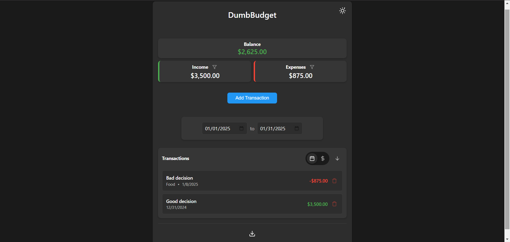

<!--
N.B.: This README was automatically generated by <https://github.com/YunoHost/apps/tree/master/tools/readme_generator>
It shall NOT be edited by hand.
-->

# DumbBudget for YunoHost

[](https://ci-apps.yunohost.org/ci/apps/dumbbudget/)


[](https://install-app.yunohost.org/?app=dumbbudget)

*[Read this README in other languages.](./ALL_README.md)*

> *This package allows you to install DumbBudget quickly and simply on a YunoHost server.*  
> *If you don't have YunoHost, please consult [the guide](https://yunohost.org/install) to learn how to install it.*

## Overview

A simple, secure personal budgeting app with PIN protection. Track your income and expenses with a clean, modern interface.

### Features

    🔒 PIN-protected access
    💰 Track income and expenses
    📊 Real-time balance calculations
    🏷️ Categorize transactions
    📅 Date range filtering
    🔄 Sort by date or amount
    📱 Responsive design
    🌓 Light/Dark theme
    📤 Export to CSV
    🔍 Filter transactions by type
    💱 Multi-currency support


**Shipped version:** 1.0.0~ynh1

## Screenshots



## Documentation and resources

- Official app website: <https://www.dumbware.io/>
- Upstream app code repository: <https://github.com/DumbWareio/DumbBudget>
- YunoHost Store: <https://apps.yunohost.org/app/dumbbudget>
- Report a bug: <https://github.com/YunoHost-Apps/dumbbudget_ynh/issues>

## Developer info

Please send your pull request to the [`testing` branch](https://github.com/YunoHost-Apps/dumbbudget_ynh/tree/testing).

To try the `testing` branch, please proceed like that:

```bash
sudo yunohost app install https://github.com/YunoHost-Apps/dumbbudget_ynh/tree/testing --debug
or
sudo yunohost app upgrade dumbbudget -u https://github.com/YunoHost-Apps/dumbbudget_ynh/tree/testing --debug
```

**More info regarding app packaging:** <https://yunohost.org/packaging_apps>
