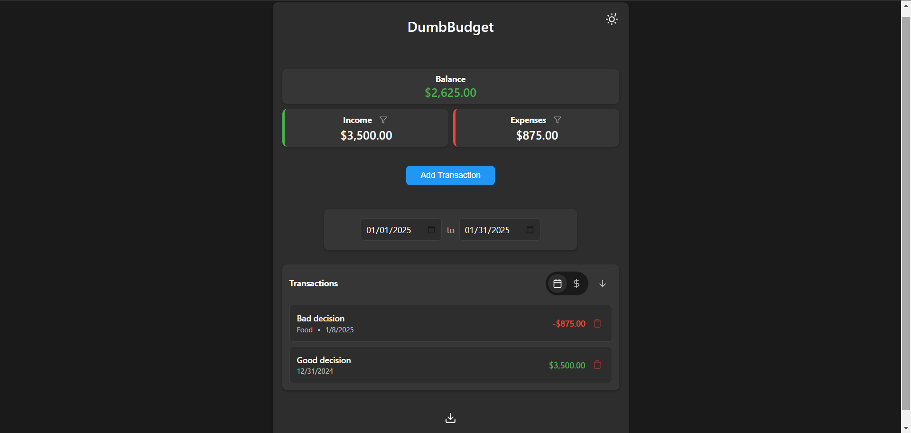

<!--
NOTA: Este README foi creado automáticamente por <https://github.com/YunoHost/apps/tree/master/tools/readme_generator>
NON debe editarse manualmente.
-->

# DumbBudget para YunoHost

[](https://ci-apps.yunohost.org/ci/apps/dumbbudget/)


[](https://install-app.yunohost.org/?app=dumbbudget)

*[Le este README en outros idiomas.](./ALL_README.md)*

> *Este paquete permíteche instalar DumbBudget de xeito rápido e doado nun servidor YunoHost.*  
> *Se non usas YunoHost, le a [documentación](https://yunohost.org/install) para saber como instalalo.*

## Vista xeral

A simple, secure personal budgeting app with PIN protection. Track your income and expenses with a clean, modern interface.

### Features

- PIN-protected access
- Track income and expenses
- Real-time balance calculations
- Categorize transactions
- Date range filtering
- Sort by date or amount
- Responsive design
- Light/Dark theme
- Export to CSV
- Filter transactions by type
- Multi-currency support


**Versión proporcionada:** 1.0.0~ynh1

## Capturas de pantalla



## Documentación e recursos

- Web oficial da app: <https://www.dumbware.io/>
- Repositorio de orixe do código: <https://github.com/DumbWareio/DumbBudget>
- Tenda YunoHost: <https://apps.yunohost.org/app/dumbbudget>
- Informar dun problema: <https://github.com/YunoHost-Apps/dumbbudget_ynh/issues>

## Info de desenvolvemento

Envía a túa colaboración á [rama `testing`](https://github.com/YunoHost-Apps/dumbbudget_ynh/tree/testing).

Para probar a rama `testing`, procede deste xeito:

```bash
sudo yunohost app install https://github.com/YunoHost-Apps/dumbbudget_ynh/tree/testing --debug
ou
sudo yunohost app upgrade dumbbudget -u https://github.com/YunoHost-Apps/dumbbudget_ynh/tree/testing --debug
```

**Máis info sobre o empaquetado da app:** <https://yunohost.org/packaging_apps>
